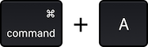
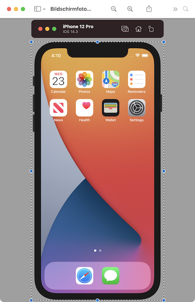

# Xcode Simulator Screenshots
Make a screenshot of your Xcode Simulator **with device bezels** and **without drop shadow**. Perfect for a GitHub-Repository-Readme.

## Step by step

Start your app in the simulator. Then press the following shortcut:

The cursor is now a camera icon. Hold

 

and click on the simulator window.

Open the image (usually on desktop) with Previews. Press the following shortcut:

Move the upper handle to the top of the iPhone, like this:

Now press the following shortcut:

The screenshot is ready to use. For example in a GitHub README.md.

